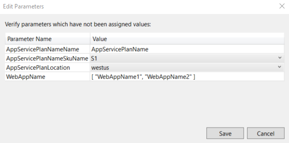
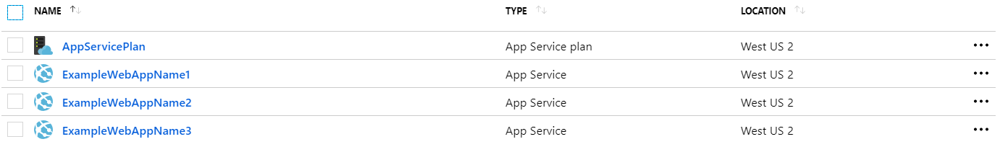

# Microsoft-Azure-ARM-AppService-Deployment
This Azure Resource Management solution allows you to deploy an Azure App Service Plan with X-amount of App Services. 

## Instructions
1. Clone repository to workstation/server
2. Open project in Microsoft Visual Studio 2017
3. Create a new deployment to Microsoft Azure
  A. Right click Azure-Web-App-Deployment-Template solution in the Solution Explorer
  B. Select Deploy
  C. Select New
  D. Enter Microsoft Azure Credentials for the target Subscription
4. Enter the parameters to define your App Service Plan and App Services (**figure A**)
  * AppServicePlanName: *App Service Plan Name*
  * AppServicePlanSku: *Defines the resource allocation and cost*
  * AppServicePlanLocation: *Defines the App Service Plan's hosted location*
  * WebAppName: *An array to set amount and name of App Service to instantiate and assign to the App Service Plan*
    ** *The App Service name must be unique globally on Microsoft Azure*
5. Select Deploy
6. Upon successful deployment, each Azure resource will be available in target subscription (**figure B**)

## Visuals
### (**figure A**)

### (**figure B**)

